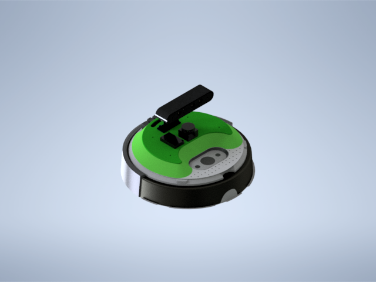
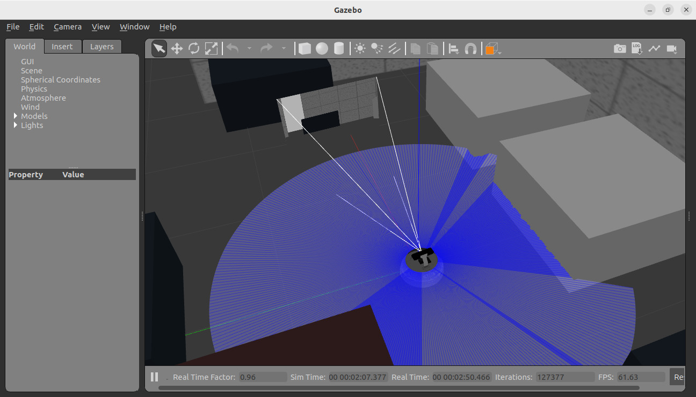
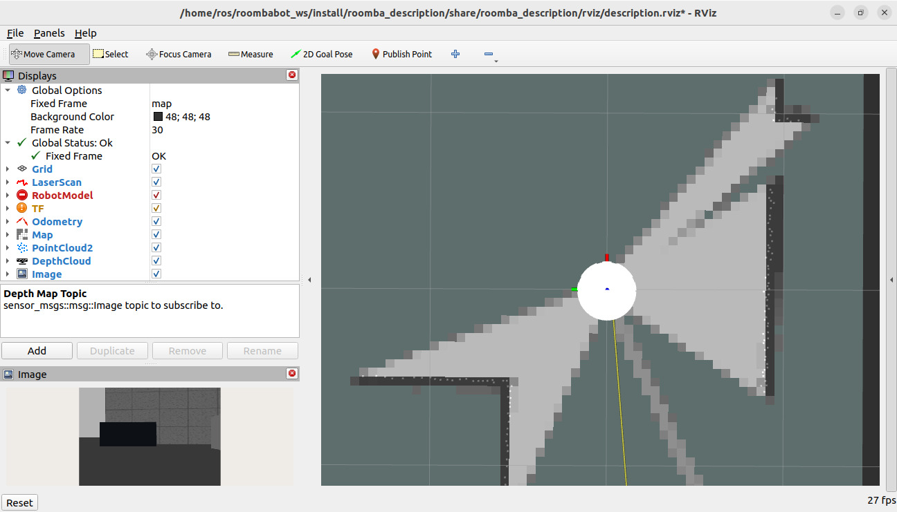
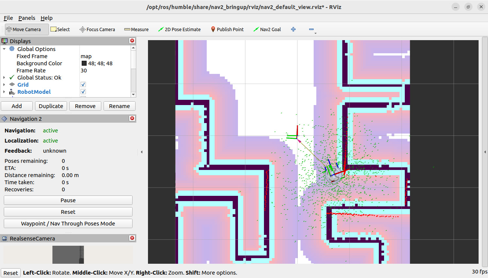

<div align="center">

  # RoombaBot

</div>

<p align="center">
  
</p>

The ROOMBA BOT 3 is an affordable and versatile mobile robotics platform designed for educators, students, and developers. It features on-board sensors and actuators for developing and testing robotics algorithms. The software is based on ROS 2, utilizing ROS 2 publications for sensor data and servers/subscriptions for actuator control. The robot comes with built-in autonomous behaviors like docking and obstacle reactions, customizable through ROS 2 actions and parameters. Suitable for beginner to advanced ROS 2 users, it supports various programming methods and offers Wi-Fi, Bluetooth, Ethernet over USB connections, and a removable faceplate for attaching payloads.

## :wrench: Setting up

Before starting to run the .launch.py files for simulation, we need to install all the necessary libraries, packages, and dependencies. This is done with the following commands:


```
cd <path_WS>
```

```
colcon build
```

```
source install/local_setup.bash && source install/setup.bash
```

```
cd src
```

```
rosdep install --from-paths . --ignore-src -y
```


Once all the necessary dependencies are installed, we check if everything is correct and run the gazebo launch for the robot description:

```
colcon build
```

```
ros2 launch roomba_description gazebo.launch.py
```
<p align="center">
  
</p>

After Gazebo loads, we can use other packages like Cartographer for mapping and Nav2 for navigating in the environment. However, it's important not to use both at the same time.

```
ros2 launch roomba_cartographer cartographer.launch.py
```
<p align="center">
  
</p>


```
ros2 launch roomba_nav2 navigation2.launch.py
```
<p align="center">
  
</p>


These packages activate the necessary topics and nodes to move the robot within the environment. For Cartographer, we can use the following command to move the robot around the world:

```
ros2 run teleop_twist_keyboard teleop_twist_keyboard
```

This will load a keyboard interface for controlling the robot in the environment.

```
This node takes keypresses from the keyboard and publishes them as Twist
messages. It works best with a US keyboard layout.
---------------------------
Moving around:
   u    i    o
   j    k    l
   m    ,    .

For Holonomic mode (strafing), hold down the shift key:
---------------------------
   U    I    O
   J    K    L
   M    <    >

t : up (+z)
b : down (-z)

anything else : stop

q/z : increase/decrease max speeds by 10%
w/x : increase/decrease only linear speed by 10%
e/c : increase/decrease only angular speed by 10%

CTRL-C to quit
```